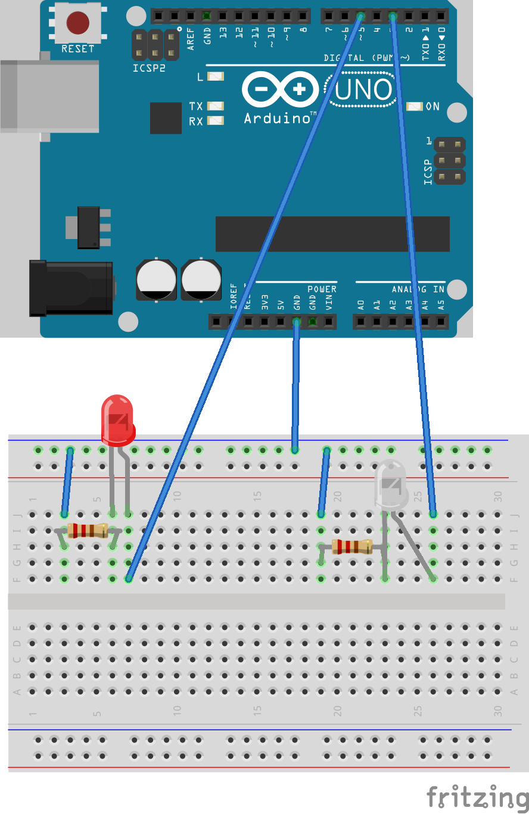
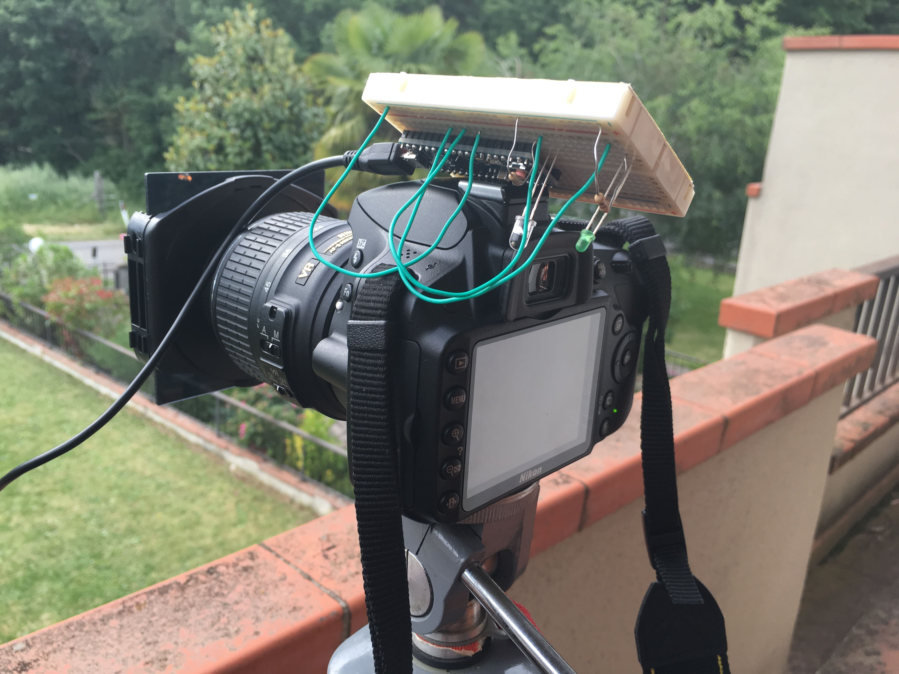

# ArduinoTimeLapse
Use Arduino as a camera remote to create time lapses.  
This code is for Nikon cameras only.

## Usage
You can set the time between photos changing the `LapseTime` value which is expressed in milliseconds.
Default is set to 5 seconds.

## Arduino Setup

The final setup looks like this:

Arduino has a normal LED connected to pin 5 (you can change it throug `LEDPin`) with a small resistence, and an IR LED connected to pin 3 (you can change it throug `IRPin`) also with a small resistence.

The IR LED should be directed to the IR sensor of the camera.
The colored LED signals to the user the moment the IR signal is sent.

This is the setup:

